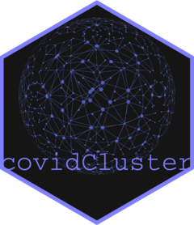

# covidCluster 

<!-- badges: start -->
[](https://codecov.io/gh/jesse-smith/covidCluster?branch=master)
[](https://github.com/jesse-smith/covidCluster/actions)
<!-- badges: end -->

The goal of covidCluster is to detect clusters of COVID-19 cases across space
and time. It does so by analyzing data on the whereabouts of interviewed cases
and identifying links between those cases. Additionally, it provides
functionality for easily computing and communicating summaries of the data.

## Installation

``` r
install.packages("devtools")
devtools::install_github("https://github.com/jesse-smith/covidCluster")
```

## Code of Conduct
  
Please note that the covidCluster project is released with a 
[Contributor Code of Conduct](https://contributor-covenant.org/version/2/0/CODE_OF_CONDUCT.html).
By contributing to this project, you agree to abide by its terms.
